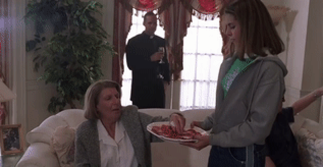

# gabagool - a UI Library for building Paks on [NextUI](https://nextui.loveretro.games)

> 🇮🇹 (Chase, Grey, & HBO Home Entertainment, 1999–2007) 🇮🇹

---

## UI Element Quick Reference

### List

If it looks like a duck, swims like a duck, and quacks like a duck, then it is probably a list!

It has the following notable features:

1. Multiselect: allow your user to submit multiple choices at once.
2. Re-order Mode: need to allow the user to dictate order, we got you covered.
3. Alternative exits for non-selections (exiting, action button, etc)
4. Customizable Footer

---

### Option List

New look, same bad taste.

A variable on the basic list that offers some extract functionality.

1. Options with selectable choice from a list.
2. Options that accept user input via keyboard.
3. Options that act like a normal list and are selectable.

Why two different lists? `¯\_(ツ)_/¯` it was easier to make. Don't like it? That's fine you are entitled to your
opinion.

---

### Keyboard

Yeah, you type stuff and hit enter.

It also features:

1. Initial text
2. Cursor support (move left / right in existing text)
3. Button shortcuts for everything

---

### Download Manager

Self-explanatory, but here are some features:

1. Download one or more files
2. Cancel single / all downloads
3. Real progress bar

---

### Message

Show a message and button options. Can optionally also show an image.

---

### Processs Message

Pass in a function and the message will display until the function returns. Easy-peasy.

---

### Animation

Plays an APNG file. Can loop, autoclose, and display for a set period of time.

